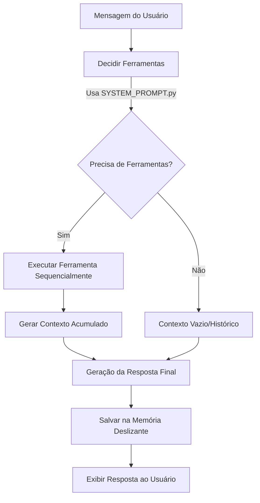

# JARVIS Acadêmico — Assistente Pessoal de Estudos

O **JARVIS Acadêmico** é um assistente universitário inteligente que integra um sistema RAG (Retrieval-Augmented Generation) com chamada de ferramentas (Tool Calling) e suporte a LLMs para auxiliar estudantes na organização de sua rotina acadêmica, gestão de tarefas e reforço de aprendizado com testes interativos.

---

## 🚀 Como Rodar o Código

### Pré-requisitos
* Python 3.10 ou superior instalado.
* Chave de API de um provedor de LLM compatível com a API da OpenAI.

### Passo a Passo

1. **Clonar o Repositório e Navegar até a Pasta**
   ```bash
   cd jarvis-academico
   ```

2. **Criar e Ativar o Ambiente Virtual (Virtual Environment)**
   ```powershell
   # No Windows (PowerShell)
   python -m venv .venv
   .venv\Scripts\Activate.ps1
   ```

3. **Instalar as Dependências**
   ```bash
   pip install -r requirements.txt
   ```

4. **Configurar as Variáveis de Ambiente**
   Crie ou edite o arquivo `.env` na raiz do projeto com os seguintes dados (conforme o seu provedor de LLM):
   ```env
   API_KEY=sua_chave_de_api
   BASE_URL=https://url-do-seu-provedor/v1
   MODEL=modelo-desejado
   ```

5. **Inicializar e Alimentar o Banco de Dados**
   O banco de dados SQLite precisa ser estruturado e, opcionalmente, populado com dados de teste:
   ```bash
   # Criar tabelas
   python src/database/init_db.py
   
   # Popular com dados acadêmicos fictícios (opcional)
   python src/database/seed_db.py
   ```

6. **Adicionar Seus PDFs para o RAG**
   Coloque os documentos acadêmicos em formato PDF que você deseja usar para estudo dentro da pasta `data/`. Se a pasta não existir, crie-a na raiz do projeto.

7. **Executar a Aplicação**
   Você pode interagir com o JARVIS de duas formas:
   * **Interface Web (Streamlit - Recomendado):**
     ```bash
     streamlit run interface.py
     ```
   * **Interface de Linha de Comando (CLI):**
     ```bash
     python main.py
     ```

---

## 🧪 Como Rodar os Testes

Os testes unitários e de integração foram desenvolvidos utilizando o framework `pytest`. Eles verificam desde a lógica de tomada de decisão do agente até a montagem de contextos e o fluxo de memória.

Para executar todos os testes, certifique-se de que o ambiente virtual está ativo e execute:
```bash
pytest
```

---

## 🧠 Lógica do Agente

O fluxo de execução do JARVIS baseia-se em um pipeline dinâmico de **Planejamento, Execução de Ferramentas e Síntese de Resposta**:



1. **Tomada de Decisão (Tool Calling / Função `decidir_tool`)**:
   Quando o usuário envia uma mensagem, o agente analisa a consulta junto ao histórico da conversa (`memory.py`). Utilizando um prompt de sistema rigoroso (`SYSTEM_PROMPT.py`), ele instrui a LLM a retornar **exclusivamente um JSON estruturado** contendo a lista de ferramentas (`tools`) necessárias e seus respectivos argumentos.
2. **Execução Resiliente (Função `executar_tool`)**:
   O `tool_manager.py` faz a triagem das ferramentas identificadas. Caso o usuário solicite ações compostas (ex: *"Conclua a tarefa X e me mostre a agenda de hoje"*), as ferramentas correspondentes são executadas sequencialmente, e seus resultados são consolidados em formato JSON (`contexto`).
3. **Geração de Resposta e Síntese**:
   O agente avalia se o fluxo exige uma formatação especial (como a criação de um plano de estudos detalhado ou o gerenciamento de perguntas de um quiz ativo). A LLM então recebe o contexto retornado pelas ferramentas e gera uma resposta final em linguagem natural formatada em Markdown.
4. **Memória Deslizante (Active Memory)**:
   A interação é armazenada em uma memória que mantém um limite dinâmico de até 10 mensagens para não extrapolar a janela de contexto da LLM.

---

## 🛠️ Catálogo de Funcionalidades (Tools)

O JARVIS Acadêmico expõe uma gama de ferramentas organizadas pelo tipo de operação que realizam no banco de dados e no fluxo de estudos:

### 1. Consulta (Read)
Utilizadas para visualizar o calendário, compromissos e tarefas:
* `consultar_agenda`: Retorna as aulas agendadas para o dia e lista as provas e trabalhos previstos para os próximos 7 dias.
* `consultar_semana`: Retorna a grade completa de horários de aula de segunda a sexta-feira.
* `listar_materias`: Lista as disciplinas atualmente cadastradas no sistema.
* `listar_tarefas`: Retorna todas as tarefas pendentes cadastradas.
* `listar_tarefas_concluidas`: Apresenta o histórico de tarefas que já foram finalizadas pelo aluno.
* `listar_provas`: Recupera todas as provas cadastradas no banco.
* `listar_trabalhos`: Recupera todos os trabalhos cadastrados no banco.
* `obter_resumo_academico`: Fornece um painel consolidado com a agenda do dia, tarefas pendentes, provas e trabalhos marcados para os próximos 30 dias.

### 2. Escrita (Create)
Utilizadas para cadastrar novos itens na agenda acadêmica:
* `adicionar_na_agenda`: Adiciona um evento recorrente ou pontual à agenda (pode ser configurado para os tipos `prova`, `trabalho`, `tarefa` ou `horario`).
* `adicionar_materia`: Insere uma nova disciplina acadêmica informando o nome, professor responsável e sala de aula.
* `adicionar_tarefa`: Cria uma nova atividade genérica pendente no banco de dados.

### 3. Edição (Update)
Utilizadas para alterar informações ou datas de itens cadastrados:
* `alterar_tarefa`: Permite editar a descrição ou a data de entrega de uma tarefa existente.
* `alterar_prova`: Altera a data ou a descrição de uma prova já registrada.
* `alterar_trabalho`: Altera a data de entrega ou a descrição de um trabalho registrado.
* `alterar_materia`: Atualiza os dados de professor ou sala de aula de uma disciplina.
* `alterar_horario`: Altera o horário (dia da semana, hora de início/fim) de uma aula cadastrada.
* `concluir_tarefa`: Atualiza o status de uma tarefa pendente para "concluido".

### 4. Remoção (Delete)
Utilizadas para limpar registros do banco de dados:
* `remover_tarefa`: Exclui em definitivo uma tarefa pendente ou concluída.
* `remover_prova`: Remove uma prova com base na disciplina e data.
* `remover_trabalho`: Remove um trabalho com base na disciplina e data de entrega.
* `remover_horario`: Exclui um horário de aula específico de uma disciplina.
* `sair_da_materia`: Remove uma matéria completa do banco de dados, excluindo em cascata todas as dependências associadas (horários, provas e trabalhos cadastrados para ela).

---

## 🎓 Melhorias de Aprendizado (Active Recall & Metacognição)

O diferencial pedagógico do JARVIS é o seu conjunto de ferramentas focadas em **metacognição, revisão ativa (Active Recall) e repetição espaçada**:

* `planejar_estudos`: Gera um roteiro de estudos detalhado e dinâmico. O sistema calcula automaticamente os dias restantes até cada entrega ou avaliação, identifica o conteúdo relevante nos PDFs via RAG para essas disciplinas específicas, e monta um plano personalizado equilibrando tempos de estudo e prioridades.
* `iniciar_quiz`: Inicia uma sessão de perguntas abertas sobre um tópico fornecido. O JARVIS entra em um estado interativo (`modo_quiz = True`), resgatando conceitos diretamente dos PDFs para testar os conhecimentos do usuário em tempo real.
* `encerrar_quiz`: Finaliza o modo interativo de quiz, exibindo um balanço geral e oferecendo ao aluno a possibilidade de revisão baseada nas dificuldades apresentadas.
* `montar_revisao`: Analisa as interações do quiz concluído, identifica automaticamente as maiores lacunas de aprendizado descritas pelo aluno na conversa (Pontos Fracos) e resgata novos trechos dos PDFs via RAG para consolidar e explicar o conteúdo no qual o usuário falhou.

---

## 🔍 O Coração do Sistema: Retrieval-Augmented Generation (RAG)

O RAG é o mecanismo de busca semântica que alimenta cognitivamente o assistente. Diferente de uma ferramenta comum de banco de dados, ele permite ao JARVIS "ler" e compreender livros, apostilas e notas de aula em formato PDF.

* **Ferramenta Principal**: `buscar_material_rag` (argumento `"pergunta"` ou `"query"`).
* **Como Funciona**:
  1. Os PDFs depositados na pasta `data/` são mapeados e extraídos pelo `loader.py`.
  2. O texto de cada página é tratado e fragmentado pelo `chunker.py` em pedaços de 500 caracteres com sobreposição de 100 caracteres.
  3. Cada bloco textual é convertido em vetores pelo modelo SentenceTransformer (`all-MiniLM-L6-v2`) e armazenado localmente em um índice FAISS (`VetorStore.py`).
  4. Ao ser acionada, a busca converte a dúvida do usuário em um vetor de consulta, realiza uma busca de similaridade de cosseno (IndexFlatIP) no índice FAISS e recupera os trechos mais relevantes do material didático.
  5. O `context_builder.py` filtra trechos redundantes ou excessivamente similares (usando `SequenceMatcher`) e constrói um contexto limpo respeitando os limites da janela de contexto para alimentar o raciocínio e a resposta final do modelo LLM.


# Documentação do Dataset: Materiais Didáticos de Ciência da Computação

## 1. Origem
O dataset é composto por 9 ficheiros que contêm trechos e capítulos selecionados de três das obras mais clássicas e adotadas globalmente em cursos de Ciência da Computação e Engenharia de Software:
* **Algoritmos (Thomas H. Cormen et al.):** Focado em estruturas de dados elementares, tabelas de espalhamento (hash), árvores de busca binária e árvores vermelho-preto.
* **Redes de Computadores e a Internet (James F. Kurose e Keith W. Ross):** Focado na camada de aplicação, cobrindo os protocolos DNS, FTP, HTTP e SMTP.
* **Estruturas de Dados e Seus Algoritmos (Jayme Luiz Szwarcfiter e Lilian Markenzon):** Focado em algoritmos de ordenação (ex: Heapsort).

## 2. Tipo
Os dados estão estruturados no formato **PDF**.

## 3. Limitações
A natureza atual deste dataset impõe os seguintes desafios técnicos para a pipeline do RAG:
* **Perda de Informação Semântica Visual:** Livros como o do Cormen e do Kurose dependem fortemente de diagramas, grafos, tabelas e pseudocódigos. Extratores de texto costumam achatar esta formatação, o que pode fazer com que a descrição geométrica de uma árvore binária ou de um diagrama temporal do TCP perca o sentido para o LLM.
* **Fórmulas Matemáticas:** Livros de algoritmos contêm alta densidade de notação matemática (ex: notação Big-O, $\Theta(n~log~n)$, equações de recorrência). Extratores comuns podem quebrar estes símbolos, gerando embeddings de baixa qualidade para perguntas que envolvam complexidade computacional.

## 4. Estratégia de Chunking (Fragmentação)
Com base na execução de teste prévia (onde 1 ficheiro gerou **142 chunks**), a estratégia de chunking aplicada/recomendada para este tipo de material é a **Fragmentação por Caracteres com Sobreposição (Recursive Character Text Splitting)**:
* **Recomendação de Overlap (Sobreposição):** Como o texto é altamente académico e os conceitos estendem-se por vários parágrafos, é fundamental utilizar um overlap de pelo menos 15% a 25% (ex: 200 caracteres de sobreposição para chunks de 1000). Isto evita que uma explicação sobre o funcionamento de uma "Árvore de Busca Binária" seja cortada a meio, prejudicando a recuperação do contexto pelo modelo de linguagem.
* **Tratamento de Metadados:** É recomendado que o chunking anexe o metadado do número da página e o nome do ficheiro (`source`) a cada fragmento. Isto permite que o LLM cite adequadamente de onde extraiu a informação (ex: *"Segundo o Kurose (página 96), o DNS funciona..."*).
